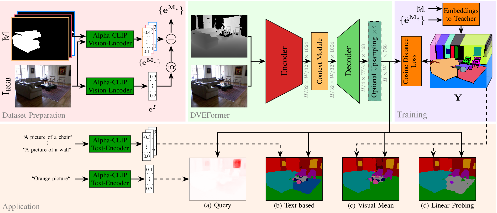
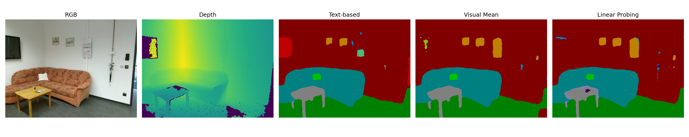

# DVEFormer: Efficient Prediction of Dense Visual Embeddings via Distillation and RGB-D Transformers
This repository contains the code to our paper 
"Efficient Prediction of Dense Visual Embeddings via Distillation and RGB-D Transformers" 
(Accepted at IROS 2025)

DVEFormer builds upon [EMSAFormer](https://github.com/TUI-NICR/EMSAFormer) 
and [EMSANet](https://github.com/TUI-NICR/EMSANet) to efficiently predict 
dense visual embeddings for scene understanding.
DVEFormer uses a Swin Transformer encoder and employs knowledge distillation from  [Alpha-CLIP](https://github.com/SunzeY/AlphaCLIP) to learn dense (pixel-wise) visual embeddings. 
DVEFormer's dense, text-aligned pixel embeddings supports flexible text-based querying, enable semantic segmentation, and can be integrated into existing 3D mapping pipelines such as [PanopticNDT](https://github.com/TUI-NICR/panoptic-mapping).



The repository includes code for training, evaluating, and applying our 
network. We also provide code for exporting the model to the ONNX format
as well as measuring the inference time with TensorRT.


## License and Citations
The source code is published under Apache 2.0 license, see 
[license file](LICENSE) for details.

> Fischedick, S., Seichter, D., Stephan, B., Schmidt, R., Gross, H.-M.
*Efficient Prediction of Dense Visual Embeddings via Distillation and RGB-D Transformers*,
accepted at IEEE/RSJ International Conference on Intelligent Robots and Systems (IROS), 2025.

<details>
<summary>BibTeX</summary>

```bibtex
@inproceedings{dveformer2025iros,  
  title={{Efficient Prediction of Dense Visual Embeddings via Distillation and RGB-D Transformers}},
  author={Fischedick, S{\"o}hnke and Seichter, Daniel and Stephan, Benedikt and Schmidt, Robin and Gross, Horst-Michael},
  booktitle={IEEE/RSJ International Conference on Intelligent Robots and Systems (IROS)},
  year={2025}
}
```

</details>


## Content

- [Installation](#installation): Set up the environment.
- [Results & Weights](#results--weights): Overview about major results and pretrained network weights.
- [Evaluation](#evaluation): Reproduce results reported in our paper.
- [Inference](#inference): Apply trained models.
    - [Dataset Inference](#dataset-inference): Apply trained model to samples from dataset.
    - [Sample Inference](#sample-inference): Apply trained model to samples in ./samples.
    - [Time Inference](#time-inference): Time inference on NVIDIA Jetson AGX Orin using TensorRT.
- [Training](#training): Train new DVEFormer model.
- [Changelog](#changelog): List of changes and updates made to the project.

## Installation
1. Clone repository:
    ```bash
    # do not forget the '--recursive'
    git clone --recursive https://github.com/TUI-NICR/DVEFormer

    # navigate to the cloned directory (required for installing some dependencies and to run the scripts later)
    cd DVEFormer
    ```

2. Create conda environment and install all dependencies:
    ```bash
    # option 1: create conda environment from provided YAML file with Python 3.11.0 and PyTorch 2.8 (latest tested version)
    conda env create -f dveformer_environment_pytorch_2_8.yml
    conda activate dveformer
    ```

    ```bash
    # option 2: create conda environment manually
    conda create -n dveformer python=3.12
    conda activate dveformer

    # install PyTorch and related packages
    python -m pip install torch==2.8.0 torchvision==0.23.0

    # remaining conda dependencies
    python -m pip install 'opencv-python==4.12.0.88'
    python -m pip install torchmetrics==1.8.2
    python -m pip install wandb==0.21.1
    python -m pip install gdown==5.2.0
    ```

3. Install submodule packages:
    ```bash
    # dataset package
    python -m pip install -e "./lib/nicr-scene-analysis-datasets[withpreparation, withauxiliarydata]"

    # multitask scene analysis package
    python -m pip install -e "./lib/nicr-multitask-scene-analysis"
    ```

4. Prepare datasets:  
    We trained our networks on 
    [NYUv2](https://cs.nyu.edu/~silberman/datasets/nyu_depth_v2.html), 
    [SUNRGB-D](https://rgbd.cs.princeton.edu/), 
    [ScanNet](http://www.scan-net.org/),
    [Hypersim](https://machinelearning.apple.com/research/hypersim), and
    [ADE20K](https://groups.csail.mit.edu/vision/datasets/ADE20K/). 

    Please follow the instructions in `./lib/nicr-scene-analysis-datasets` or [HERE](https://github.com/TUI-NICR/nicr-scene-analysis-datasets/tree/v0.8.3) to prepare the datasets. Each datasets README describes how to generate the required Alpha-CLIP embeddings for knowledge distillation as well as the DepthAnythingV2-based depth images required for ADE20K.
    In the following, we assume that they are stored at `./datasets`.


## Results & Weights
We provide weights for our DVEFormer model trained on a dataset combination 
(NYUv2 + Hypersim + SUNRGB-D + ScanNet + ADE20K) using the modified 
SwinV2-T-128 backbone from EMSAFormer, available in two configurations: a full resolution decoder that preserves the input resolution and a throughput-optimized variant outputting 1/4 of the input resolution.
We evaluated the closed-set semantic segmentation performance of our model on the three common indoor RGB-D datasets (NYUv2, SUNRGB-D and ScanNet).

### Full-resolution model
[Download](https://drive.usercontent.google.com/download?id=1FQzXfP08pYI7RGlYjODPQRpCxDBI2eDX) and extract the checkpoint to `./trained_models/`. 
The model keeps the output resolution at the input resolution, reaching 26.3 FPS on an NVIDIA Jetson AGX Orin 64 GB with TensorRT, and can be evaluated directly for text-based and visual mean-based segmentation. 
Linear probing attaches dataset-specific single linear layer that run on top of the frozen base model.
Download the weights from the "Linear Probing Weights" column, extract them to `./trained_models/`, and evaluate them by reusing `main.py` with the additional `--enable-linear-probing` and `--linear-probing-weights-path` argument. These layers are optional, and can be used to get the best segmentation performance on each dataset. 
See the notes in the training section below.

To download all full-resolution checkpoints at once, run:
```bash
gdown 1FQzXfP08pYI7RGlYjODPQRpCxDBI2eDX -O trained_models/dveformer_fullres_mixed.pth.tar.gz
gdown 1OGCOq5QDcF8e7UCFF-pK5c2HfOVyxvqX -O trained_models/dveformer_fullres_linear_probing_nyuv2.pth.tar.gz
gdown 12mCDbn1s5VQsnMMdf6FZMxLCrl9rKkQy -O trained_models/dveformer_fullres_linear_probing_sunrgbd.pth.tar.gz
gdown 1BqsVabSwFDNYRMv20eWB4yXu07FazEAO -O trained_models/dveformer_fullres_linear_probing_scannet.pth.tar.gz
gdown 1dSnkJh-Ker9CQZNQTjVj3IOcoj1zqmWk -O trained_models/dveformer_fullres_linear_probing_scannet20.pth.tar.gz

find ./trained_models -type f -name "dveformer_fullres*.tar.gz" -exec tar -xzf {} -C ./trained_models \;
```

| Dataset  | Split | #Classes | Text-based mIoU | Visual Mean-based mIoU | Linear Probing mIoU | Linear Probing Weights |
|----------|:-----:|:--------:|:---------------:|:----------------------:|:-------------------:|:----------------------:|
| NYUv2    | test  | 40       | 44.07           | 50.31                  | 57.05               | [Download](https://drive.usercontent.google.com/download?id=1OGCOq5QDcF8e7UCFF-pK5c2HfOVyxvqX) |
| SUNRGB-D | test  | 37       | 44.56           | 46.25                  | 51.28               | [Download](https://drive.usercontent.google.com/download?id=12mCDbn1s5VQsnMMdf6FZMxLCrl9rKkQy) |
| ScanNet  | valid | 40       | 33.77           | 39.59                  | 49.06               | [Download](https://drive.usercontent.google.com/download?id=1BqsVabSwFDNYRMv20eWB4yXu07FazEAO) |
| ScanNet  | valid | 20       | 50.16           | 56.57                  | 67.76               | [Download](https://drive.usercontent.google.com/download?id=1dSnkJh-Ker9CQZNQTjVj3IOcoj1zqmWk) |
| ScanNet  | test  | 20       | -               | -                      | 62.6                | same as above          |
> The reported metrics differ slightly from the numbers reported in the paper due to refactoring-induced numerical changes and minor bug fixes. The results remain close to the originally published values.
> Note: As described in the paper, we subtract an alpha-scaled full-image embedding from each Alpha-CLIP segment embedding to suppress scene context. The `--dense-visual-embedding-diff-factor` argument can be used to modify alpha (default 0.65). Leave it unchanged unless you want to reproduce ablations such as alpha = 0.

### Reduced-resolution model
[Download](https://drive.usercontent.google.com/download?id=1tkhkEA6RsvjznY-WlWqL3LtAGYU3wse_) and extract the checkpoint to `./trained_models/`.
The model keeps the output resolution at 1/4 of the original input resolution, reaching 77.0 FPS on an NVIDIA Jetson AGX Orin 64 GB with TensorRT, and can be evaluated directly for text-based and visual mean-based segmentation.
Evaluation can be done in the same way as for the full resolution model, but require `--dense-visual-embedding-decoder-n-upsamplings 0` as an additional argument.

To fetch all reduced-resolution checkpoints at once, run:
```bash
gdown 1tkhkEA6RsvjznY-WlWqL3LtAGYU3wse_ -O trained_models/dveformer_reducedres_mixed.pth.tar.gz
gdown 1Pdm1l8YLg7Spy9rEffFOwrfWVJHEwCiY -O trained_models/dveformer_reducedres_linear_probing_nyuv2.pth.tar.gz
gdown 19FUiUXhzC1o0CuEcJJwLyDbgp-9ypKD9 -O trained_models/dveformer_reducedres_linear_probing_sunrgbd.pth.tar.gz
gdown 13LplKyltdVLHaALY9NmmFk3Ib1w1veDO -O trained_models/dveformer_reducedres_linear_probing_scannet.pth.tar.gz
gdown 1vbg0MnH6VRAg-tiMGaLy1P5uX0blX5sw -O trained_models/dveformer_reducedres_linear_probing_scannet20.pth.tar.gz

find ./trained_models -type f -name "dveformer_reducedres*.tar.gz" -exec tar -xzf {} -C ./trained_models \;
```

| Dataset  | Split | #Classes | Text-based mIoU | Visual Mean-based mIoU | Linear Probing mIoU | Linear Probing Weights |
|----------|:-----:|:--------:|:---------------:|:----------------------:|:-------------------:|:----------------------:|
| NYUv2    | test  | 40       | 43.45           | 50.02                  | 56.28               | [Download](https://drive.usercontent.google.com/download?id=1Pdm1l8YLg7Spy9rEffFOwrfWVJHEwCiY) |
| SUNRGB-D | test  | 37       | 44.01           | 45.71                  | 50.01               | [Download](https://drive.usercontent.google.com/download?id=19FUiUXhzC1o0CuEcJJwLyDbgp-9ypKD9) |
| ScanNet  | valid | 40       | 33.58           | 39.19                  | 48.75               | [Download](https://drive.usercontent.google.com/download?id=13LplKyltdVLHaALY9NmmFk3Ib1w1veDO) |
| ScanNet  | valid | 20       | 50.32           | 56.75                  | 67.44               | [Download](https://drive.usercontent.google.com/download?id=1vbg0MnH6VRAg-tiMGaLy1P5uX0blX5sw) |
> Note: As ScanNet test evaluation can only be done using the official evaluation server, which only allow a single submission, we only provide validation results for this model.


## Evaluation
We support three evaluation modes:
- **Text-based mIoU** embeds each class name with the CLIP text encoder and assigns the class whose text embedding has the highest cosine similarity to the pixel embedding.
- **Visual mean-based mIoU** uses the mean per class embedding of the teacher and assigns the class with the highest cosine similarity to each pixel embedding.
- **Linear probing mIoU** keeps the encoder frozen and trains an additional 1x1 convolution that maps embeddings to class logits. See [Linear Probing](#linear-probing) for details.

The evaluation assumes the datasets are stored at `./datasets`. 
The examples include `--enable-tf32`, `--encoder-amp bfp16`, `--context-module-amp bfp16`, and `--decoder-amp bfp16`, which were used for faster training.
Drop these flags if your GPU does not support TensorFloat-32/bfloat16 execution.
However doing so may slightly change the reported metrics.

Text-based and visual mean-based evaluation require no additional training. 
Run `main.py` as done for training with `--validation-only`.

Optionally, if a dataset specific linear probing head was trained, the `--enable-linear-probing` and `--linear-probing-weights-path` arguments can be added, to evaluate the linear probing layer as well.
All commands below include the linear probing head so that all reported numbers are reproduced.
However, if this evaluation is not of interest, the arguments can be dropped.

The commands below reproduce the semantic mIoU for text-based, visual mean-based, and linear probing segmentation for the full resolution and lower resolution (1/4 of input resolution) model.

### NYUv2 (test split, 40 classes)
To evaluate the full resolution model run:
```bash
python main.py \
    --dataset nyuv2 \
    --dataset-path ./datasets/nyuv2 \
    --tasks dense-visual-embedding \
    --raw-depth \
    --enable-tf32 \
    --encoder-amp bfp16 \
    --context-module-amp bfp16 \
    --decoder-amp bfp16 \
    --weights-filepath ./trained_models/mixed/dveformer_fullres_mixed.pth \
    --dense-visual-embedding-decoder-n-channels-out 512 \
    --enable-linear-probing \
    --linear-probing-weights-path ./trained_models/nyuv2/dveformer_fullres_linear_probing_nyuv2.pth \
    --validation-batch-size 2 \
    --validation-only \
    --skip-sanity-check \
    --wandb-mode disabled
```

```text
Validation results:
{
  ...,
  'valid_dense_visual_embedding_text_based_miou': tensor(0.4407),
  ...,
  'valid_dense_visual_embedding_visual_mean_based_miou': tensor(0.5031),
  ...,
  'valid_linear_probing_miou': tensor(0.5705),
  ...
}
```

To evaluate the reduced resolution model, add `--dense-visual-embedding-decoder-n-upsamplings 0` and adjust the checkpoint files:
```bash
python main.py \
    --dataset nyuv2 \
    --dataset-path ./datasets/nyuv2 \
    --tasks dense-visual-embedding \
    --raw-depth \
    --enable-tf32 \
    --encoder-amp bfp16 \
    --context-module-amp bfp16 \
    --decoder-amp bfp16 \
    --weights-filepath ./trained_models/mixed/dveformer_reducedres_mixed.pth \
    --dense-visual-embedding-decoder-n-channels-out 512 \
    --dense-visual-embedding-decoder-n-upsamplings 0 \
    --enable-linear-probing \
    --linear-probing-weights-path ./trained_models/nyuv2/dveformer_reducedres_linear_probing_nyuv2.pth \
    --validation-batch-size 2 \
    --validation-only \
    --skip-sanity-check \
    --wandb-mode disabled
```
```text
Validation results:
{
  ...,
  'valid_dense_visual_embedding_text_based_miou': tensor(0.4345),
  ...,
  'valid_dense_visual_embedding_visual_mean_based_miou': tensor(0.5002),
  ...,
  'valid_linear_probing_miou': tensor(0.5628),
  ...
}
```

### SUNRGB-D (test split, 37 classes)
To evaluate the full resolution model, run:
```bash
python main.py \
    --dataset sunrgbd \
    --dataset-path ./datasets/sunrgbd \
    --tasks dense-visual-embedding \
    --raw-depth \
    --enable-tf32 \
    --encoder-amp bfp16 \
    --context-module-amp bfp16 \
    --decoder-amp bfp16 \
    --weights-filepath ./trained_models/mixed/dveformer_fullres_mixed.pth \
    --dense-visual-embedding-decoder-n-channels-out 512 \
    --enable-linear-probing \
    --linear-probing-weights-path ./trained_models/sunrgbd/dveformer_fullres_linear_probing_sunrgbd.pth \
    --validation-batch-size 2 \
    --validation-only \
    --skip-sanity-check \
    --wandb-mode disabled
```

```text
Validation results:
{
  ...,
  'valid_dense_visual_embedding_text_based_miou': tensor(0.4456),
  ...,
  'valid_dense_visual_embedding_visual_mean_based_miou': tensor(0.4625),
  ...,
  'valid_linear_probing_miou': tensor(0.5128),
  ...
}
```

To evaluate the reduced resolution model, run:
```bash
python main.py \
    --dataset sunrgbd \
    --dataset-path ./datasets/sunrgbd \
    --tasks dense-visual-embedding \
    --raw-depth \
    --enable-tf32 \
    --encoder-amp bfp16 \
    --context-module-amp bfp16 \
    --decoder-amp bfp16 \
    --weights-filepath ./trained_models/mixed/dveformer_reducedres_mixed.pth \
    --dense-visual-embedding-decoder-n-channels-out 512 \
    --dense-visual-embedding-decoder-n-upsamplings 0 \
    --enable-linear-probing \
    --linear-probing-weights-path ./trained_models/sunrgbd/dveformer_reducedres_linear_probing_sunrgbd.pth \
    --validation-batch-size 2 \
    --validation-only \
    --skip-sanity-check \
    --wandb-mode disabled
```

```text
Validation results:
{
  ...,
  'valid_dense_visual_embedding_text_based_miou': tensor(0.4401),
  ...,
  'valid_dense_visual_embedding_visual_mean_based_miou': tensor(0.4571),
  ...,
  'valid_linear_probing_miou': tensor(0.5001),
  ...
}
```

### ScanNet (validation split, 40 classes)
To evaluate the full resolution model, run:
```bash
python main.py \
    --dataset scannet \
    --dataset-path ./datasets/scannet \
    --tasks dense-visual-embedding \
    --raw-depth \
    --enable-tf32 \
    --encoder-amp bfp16 \
    --context-module-amp bfp16 \
    --decoder-amp bfp16 \
    --weights-filepath ./trained_models/mixed/dveformer_fullres_mixed.pth \
    --dense-visual-embedding-decoder-n-channels-out 512 \
    --scannet-semantic-n-classes 40 \
    --enable-linear-probing \
    --linear-probing-weights-path ./trained_models/scannet/dveformer_fullres_linear_probing_scannet.pth \
    --validation-split valid \
    --validation-batch-size 2 \
    --validation-only \
    --skip-sanity-check \
    --wandb-mode disabled
```

```text
Validation results:
{
  ...,
  'valid_dense_visual_embedding_text_based_miou': tensor(0.3377),
  ...,
  'valid_dense_visual_embedding_visual_mean_based_miou': tensor(0.3959),
  ...,
  'valid_linear_probing_miou': tensor(0.4906),
  ...
}
```

To evaluate the reduced resolution model, run:
```bash
python main.py \
    --dataset scannet \
    --dataset-path ./datasets/scannet \
    --tasks dense-visual-embedding \
    --raw-depth \
    --enable-tf32 \
    --encoder-amp bfp16 \
    --context-module-amp bfp16 \
    --decoder-amp bfp16 \
    --weights-filepath ./trained_models/mixed/dveformer_reducedres_mixed.pth \
    --dense-visual-embedding-decoder-n-channels-out 512 \
    --dense-visual-embedding-decoder-n-upsamplings 0 \
    --scannet-semantic-n-classes 40 \
    --enable-linear-probing \
    --linear-probing-weights-path ./trained_models/scannet/dveformer_reducedres_linear_probing_scannet.pth \
    --validation-split valid \
    --validation-batch-size 2 \
    --validation-only \
    --skip-sanity-check \
    --wandb-mode disabled
```

```text
Validation results:
{
  ...,
  'valid_dense_visual_embedding_text_based_miou': tensor(0.3358),
  ...,
  'valid_dense_visual_embedding_visual_mean_based_miou': tensor(0.3919),
  ...,
  'valid_linear_probing_miou': tensor(0.4875),
  ...
}
```

### ScanNet (validation split, 20 classes)
To evaluate the full resolution model, run:
```bash
python main.py \
    --dataset scannet \
    --dataset-path ./datasets/scannet \
    --tasks dense-visual-embedding \
    --raw-depth \
    --enable-tf32 \
    --encoder-amp bfp16 \
    --context-module-amp bfp16 \
    --decoder-amp bfp16 \
    --weights-filepath ./trained_models/mixed/dveformer_fullres_mixed.pth \
    --dense-visual-embedding-decoder-n-channels-out 512 \
    --scannet-semantic-n-classes 20 \
    --enable-linear-probing \
    --linear-probing-weights-path ./trained_models/scannet/dveformer_fullres_linear_probing_scannet20.pth \
    --validation-split valid \
    --validation-batch-size 2 \
    --validation-only \
    --skip-sanity-check \
    --wandb-mode disabled
```

```text
Validation results:
{
  ...,
  'valid_dense_visual_embedding_text_based_miou': tensor(0.5016),
  ...,
  'valid_dense_visual_embedding_visual_mean_based_miou': tensor(0.5657),
  ...,
  'valid_linear_probing_miou': tensor(0.6776),
  ...
}
```

To evaluate the reduced resolution model, run:
```bash
python main.py \
    --dataset scannet \
    --dataset-path ./datasets/scannet \
    --tasks dense-visual-embedding \
    --raw-depth \
    --enable-tf32 \
    --encoder-amp bfp16 \
    --context-module-amp bfp16 \
    --decoder-amp bfp16 \
    --weights-filepath ./trained_models/mixed/dveformer_reducedres_mixed.pth \
    --dense-visual-embedding-decoder-n-channels-out 512 \
    --dense-visual-embedding-decoder-n-upsamplings 0 \
    --scannet-semantic-n-classes 20 \
    --enable-linear-probing \
    --linear-probing-weights-path ./trained_models/scannet/dveformer_reducedres_linear_probing_scannet20.pth \
    --validation-split valid \
    --validation-batch-size 2 \
    --validation-only \
    --skip-sanity-check \
    --wandb-mode disabled
```

```text
Validation results:
{
  ...,
  'valid_dense_visual_embedding_text_based_miou': tensor(0.5032),
  ...,
  'valid_dense_visual_embedding_visual_mean_based_miou': tensor(0.5675),
  ...,
  'valid_linear_probing_miou': tensor(0.6744),
  ...
}
```

## Inference
We provide scripts for inference on both samples drawn from one of our used 
datasets (`main.py` with additional arguments) and samples located in 
`./samples` (`inference_samples.py`)

### Dataset Inference
To run inference on a dataset with dense visual embedding prediction, use `main.py` together with `--validation-only` and `--visualize-validation`. By default the visualised outputs are written next to the checkpoint; override the destination with `--visualization-output-path` if required.

```bash
python main.py \
    --dataset nyuv2 \
    --dataset-path ./datasets/nyuv2 \
    --tasks dense-visual-embedding \
    --raw-depth \
    --enable-tf32 \
    --encoder-amp bfp16 \
    --context-module-amp bfp16 \
    --decoder-amp bfp16 \
    --weights-filepath ./trained_models/mixed/dveformer_fullres_mixed.pth \
    --dense-visual-embedding-decoder-n-channels-out 512 \
    --enable-linear-probing \
    --linear-probing-weights-path ./trained_models/nyuv2/dveformer_fullres_linear_probing_nyuv2.pth \
    --validation-batch-size 2 \
    --validation-only \
    --visualize-validation \
    --visualization-output-path ./results/visualized_outputs/nyuv2 \
    --skip-sanity-check \
    --wandb-mode disabled
```
The same setup applies to SUNRGB-D and ScanNet by adjusting `--dataset`, `--dataset-path`, the checkpoint file, and the linear probing file. `inference_dataset.py` can be used to generate ScanNet submissions in the official evaluation format.

### Sample Inference
`inference_samples.py` applies a trained model to the Kinect v2 example stored in `./samples`.

```bash
python inference_samples.py \
    --dataset nyuv2 \
    --dataset-path ./datasets/nyuv2 \
    --tasks dense-visual-embedding \
    --raw-depth \
    --weights-filepath ./trained_models/mixed/dveformer_fullres_mixed.pth \
    --enable-linear-probing \
    --linear-probing-weights-path ./trained_models/nyuv2/dveformer_fullres_linear_probing_nyuv2.pth \
    --dense-visual-embedding-decoder-n-channels-out 512 \
    --depth-max 8000 \
    --depth-scale 8 \
    --show-results
```
> Note that the dataset argument is required to determine the correct dataset configuration (classes, colors, ...).
> The `--dataset-path` is required for text-based and visual mean-based evaluation, as it provides the reference embeddings and is optional. If not provided, both predictions will be skipped.
> Linear probing is optional as well.



### Time Inference
We timed the inference on an NVIDIA Jetson AGX Orin with Jetpack 6.2 (TensorRT 10.3, PyTorch 2.7.0/torchvision 0.22.0).

Reproducing the timings on an NVIDIA Jetson AGX Orin further requires:
- installing PyTorch and TorchVision via `pip3 install --index-url https://pypi.jetson-ai-lab.io/jp6/cu126 torch==2.7.0 torchvision==0.22.0`
- enabling MAXN power mode
- installation of DVEFormer dependencies

Subsequently, you can run `./inference_time.bash` (set `DATASET_PATH` if you want to use real samples) to reproduce the reported timings.

## Training
Use `main.py` to train DVEFormer on various dataset combinations or any other dataset that you implemented following the implementation of the provided datasets. 
Evaluating every dataset during training adds significant overhead, so we only enable evaluation on NYUv2 while training the model.

> Note that training our DVEFormer with our selected SwinV2-T-128 encoder requires 
pretrained weights. You can download our pretrained weights on ImageNet from 
[Link](https://drive.usercontent.google.com/download?id=1YzwHYuKfyBX4AD6f8snFKYtId3shvDx3). 
Alternatively you can directly download it by:
```bash
gdown 1YzwHYuKfyBX4AD6f8snFKYtId3shvDx3 -O trained_models/imagenet_swin_multi_t_v2_128.tar.gz

tar -xzf trained_models/imagenet_swin_multi_t_v2_128.tar.gz -C trained_models
```

> Note that we trained all models on NVIDIA A100-SXM4-40GB GPUs with batch 
size of 4. Training the model on a GPU with less VRAM might not work. 

Example: Train DVEFormer on the mixed dataset combination:
```bash
python main.py \
    --results-basepath ./results \
    --dataset nyuv2:hypersim:sunrgbd:scannet:ade20k^depthanything_v2__indoor_large \
    --dataset-path ./datasets/nyuv2:./datasets/hypersim:./datasets/sunrgbd:./datasets/scannet:./datasets/ade20k \
    --raw-depth \
    --subset-train 1.0:0.1:1.0:0.25:1.0 \
    --split train:train:train:train:train_panoptic_2017 \
    --validation-split test:none:none:none:none \
    --input-modalities rgbd \
    --tasks dense-visual-embedding \
    --rgbd-encoder-backbone swin-multi-t-v2-128 \
    --rgbd-encoder-backbone-pretrained-weights-filepath ./trained_models/imagenet/dveformer_swin_multi_t_v2_128.pth \
    --dense-visual-embedding-decoder-n-channels-out 512 \
    --validation-skip 0.9 \
    --checkpointing-skip 0.9 \
    --checkpointing-best-only \
    --checkpointing-metrics valid_total_loss valid_dense_visual_embedding_text_based_miou valid_dense_visual_embedding_visual_mean_based_miou \
    --compile-model \
    --enable-tf32 \
    --encoder-amp bfp16 \
    --context-module-amp bfp16 \
    --decoder-amp bfp16 \
    --batch-size 4 \
    --validation-batch-size 4 \
    --learning-rate 5e-5 \
    --n-epochs 250 \
    --wandb-mode disabled
```
> Note: To train the reduced resolution model append `--dense-visual-embedding-decoder-n-upsamplings 0` to the command.

> Dataset concatenation is achieved using `:` as the delimiter.
The `--subset-train` parameter controls the fraction of each dataset sampled per epoch. For example, setting hypersim to 0.1 draws roughly 10% of its samples each epoch, with the subset potentially changing between epochs.
For more options, we refer to `./dveformer/args.py` or simply run:

```bash
python main.py --help
```

### Linear probing (NYUv2 example)
To adapt the full resolution checkpoint to NYUv2 while keeping the backbone frozen, activate linear probing in `main.py` and initialise the head from the mean visual embeddings:

```bash
python main.py \
    --results-basepath ./results \
    --dataset nyuv2 \
    --dataset-path ./datasets/nyuv2 \
    --tasks dense-visual-embedding \
    --raw-depth \
    --weights-filepath ./trained_models/mixed/dveformer_fullres_mixed.pth \
    --dense-visual-embedding-decoder-n-channels-out 512 \
    --enable-linear-probing \
    --linear-probing-weights-init mean \
    --checkpointing-best-only \
    --checkpointing-metrics valid_linear_probing_miou \
    --enable-tf32 \
    --encoder-amp bfp16 \
    --context-module-amp bfp16 \
    --decoder-amp bfp16 \
    --batch-size 4 \
    --validation-batch-size 4 \
    --learning-rate 1e-2 \
    --n-epochs 50 \
    --validation-split test \
    --skip-sanity-check \
    --wandb-mode disabled
```
For more options, we refer to `./dveformer/args.py` or simply run:

```bash
python main.py --help
```

## Changelog
**October 15, 2025**
- Initial release of DVEFormer: Efficient Prediction of Dense Visual Embeddings via Distillation and RGB-D Transformers
